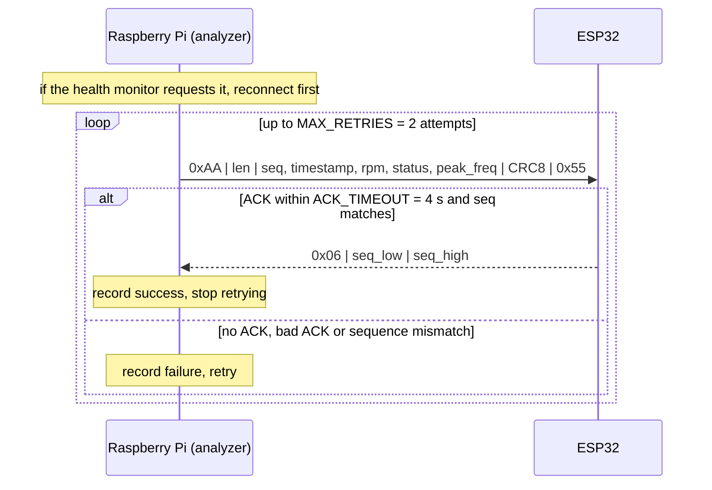
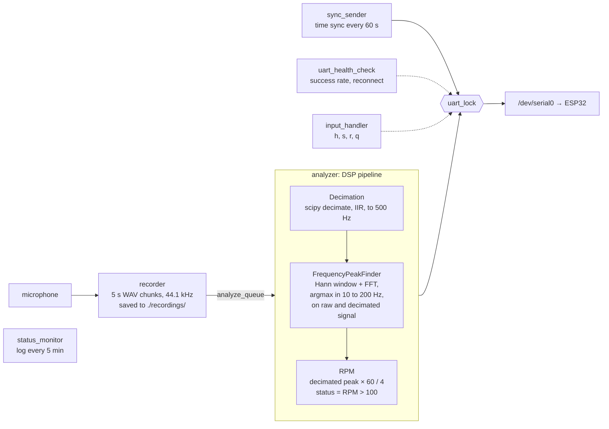

# Aircraft Engine Audio Monitor

A real-time aircraft engine monitoring system that runs on a **Raspberry Pi**, records audio from a microphone, extracts engine RPM and status via DSP, and transmits results to an **ESP32** microcontroller over UART.

Developed and tested against audio recordings from a **Tecnam P92** (Rotax 912, a 4-cylinder, 4-stroke engine). This is a personal research and prototyping project: it is not certified avionics equipment and has not been through flight-safety validation.

---

## How It Works

```
Microphone
    │
    ▼
[ Recorder thread ]
  Records 5-second WAV chunks at 44,100 Hz
  Saves to ./recordings/
    │
    ▼  (queue)
[ Analyzer thread ]
  Decimation       44,100 Hz → 500 Hz
  FFT Peak Finder  finds dominant frequency in 10 to 200 Hz band
  RPM Calculator   RPM = freq × 60 / EVENTS_PER_CYCLE
    │
    ▼
[ UART thread ]
  Sends binary packet to ESP32
  Waits for ACK
    │
    ▼
ESP32 (receives RPM, engine status, peak frequency)
```

### RPM Formula

```
RPM = peak_frequency_Hz × 60 / EVENTS_PER_CYCLE
```

`EVENTS_PER_CYCLE = 4` is set to match the 2nd harmonic of the Rotax 912 firing frequency, which dominates in real recordings. The engine is considered **ON** when RPM > 100.

---

## Hardware

| Component | Role |
|-----------|------|
| Raspberry Pi (Zero / 3 / 4) | Runs the Python audio processing system |
| USB or I2S microphone | Captures engine audio |
| ESP32 | Receives RPM data over UART, drives display and alerts |

**Wiring (UART):**

```
RPi GPIO14 (TX)  ──►  ESP32 RX
RPi GPIO15 (RX)  ──►  ESP32 TX
RPi GND          ──►  ESP32 GND
```

---

## Project Structure

```
aircraft-engine-monitor/
├── rpi_test_final.py   # Main application, deploy this on the RPi
├── rpi_test.py         # Earlier iteration of the monitoring script
├── rpi_test_fft.py     # Iteration with added FFT export/logging
├── rpi_test_new.py     # Iteration with rule-based engine-state classification
├── test_pipeline.py    # Level 1 test: DSP pipeline, no hardware needed
├── mock_esp32.py        # Level 2 test: virtual ESP32 over socat UART
├── test_hardware.py    # Level 3 test: full hardware check on the RPi
├── docs/               # Technical documentation
└── requirements (see Running the System)
```

`rpi_test.py`, `rpi_test_fft.py`, and `rpi_test_new.py` are earlier development iterations kept for reference; `rpi_test_final.py` is the version documented below and used by `test_pipeline.py` and `test_hardware.py`.

At runtime the system also creates `recordings/` (recorded WAV chunks) and `audio_system.log`; these, along with local development and simulation assets such as `simulation_data/audios/` and `audio_chunks/`, are excluded from the repository via `.gitignore`. Because `simulation_data/audios/` is not included, `test_pipeline.py` skips the WAV-file cases when the files are absent and still runs its synthetic silent-signal and tone tests.

---

## Configuration

All tuneable parameters are constants at the top of `rpi_test_final.py`:

| Constant | Default | Description |
|----------|---------|-------------|
| `RECORD_SECONDS` | `5` | Duration of each audio chunk |
| `SAMPLE_RATE` | `44100` | Microphone sample rate (Hz) |
| `DECIMATED_RATE` | `500` | Target rate after downsampling (Hz) |
| `EVENTS_PER_CYCLE` | `4` | Harmonic index used in RPM formula |
| `UART_PORT` | `/dev/serial0` | Serial port connected to ESP32 |
| `UART_BAUDRATE` | `115200` | UART baud rate |
| `AUDIO_DIR` | `./recordings` | Where WAV chunks are saved |
| `CLEAN_INTERVAL_DAYS` | `7` | How often old recordings are purged |
| `MIN_FREE_SPACE_GB` | `1.0` | Disk free space threshold before cleanup |
| `SYNC_INTERVAL` | `60` | Seconds between time-sync packets to ESP32 |
| `HEALTH_CHECK_INTERVAL` | `60` | Seconds between UART health checks |
| `MAX_CONSECUTIVE_FAILURES` | `5` | UART failures before forced reconnect |

---

## UART Protocol

All packets share the same framing:

```
[ START_BYTE | LENGTH | PAYLOAD... | CRC8 | 0x55 ]
```

| Packet type | Start byte | Payload |
|-------------|-----------|---------|
| Data | `0xAA` | `seq(2) + timestamp_ms(8) + rpm(4f) + status(1) + peak_freq(4f)` |
| Record alert | `0xAC` | `timestamp_ms(8)` |
| Time sync | `0xAB` | `timestamp_ms(8)` |

The ESP32 must reply to **Data** packets with a 3-byte ACK:

```
[ 0x06 | seq_low | seq_high ]
```

CRC8 uses polynomial `0x07` (same as CRC-8/SMBUS).

The acknowledgement exchange for one data packet (`send_uart_packet`):



Time-sync (`0xAB`) and record-alert (`0xAC`) packets use the same framing.

---

## Running the System

### Dependencies

```bash
pip install numpy scipy sounddevice pyserial psutil
```

### Start

```bash
python rpi_test_final.py
```

**Interactive commands** (type and press Enter):

| Key | Action |
|-----|--------|
| `h` | Print UART health status |
| `s` | Send a time-sync packet immediately |
| `r` | Force UART reconnection |
| `q` | Graceful shutdown |
| `Ctrl+C` | Emergency stop |

---

## Testing

### Level 1: DSP pipeline (no hardware, runs on any machine)

```bash
python test_pipeline.py
```

Runs the synthetic silent-signal and pure-tone checks directly (RPM = 0 for silence, RPM in [1000, 1500] for an 83.3 Hz tone treated as the 2nd harmonic). If WAV files are present under `simulation_data/audios/` (not included in this repository), the script also validates RPM and engine status against those recordings; otherwise those cases are skipped.

---

### Level 2: UART simulation (no ESP32 hardware)

Requires `socat` (`brew install socat` on Mac, `apt install socat` on Linux).

**Terminal 1**: create a virtual serial port pair:
```bash
socat -d -d pty,raw,echo=0 pty,raw,echo=0
# note the two /dev/ttys??? paths printed, e.g. /dev/ttys004 and /dev/ttys005
```

**Terminal 2**: start the mock ESP32 (use the second port):
```bash
python mock_esp32.py /dev/ttys005
```

**Terminal 3**: temporarily change `UART_PORT` in `rpi_test_final.py` to the first port, then run:
```bash
python rpi_test_final.py
```

The mock ESP32 validates CRC, sends ACKs, and logs every received packet with RPM and engine status.

---

### Level 3: Full hardware test (run on Raspberry Pi)

```bash
python test_hardware.py
```

Checks:
1. Microphone detected and records a 2-second clip without error
2. DSP pipeline processes the clip and returns finite, sane values
3. `/dev/serial0` opens successfully, sync packet sends, ESP32 ACK received

Exit code `0` = all checks passed.

---

## Threads

The system runs six concurrent daemon threads:

| Thread | Role |
|--------|------|
| `recorder` | Records 5-second audio chunks in a loop |
| `analyzer` | Consumes chunks from the queue, runs the DSP pipeline, sends UART packets |
| `uart_health_check` | Monitors UART success rate, triggers reconnection if needed |
| `status_monitor` | Logs system status every 5 minutes |
| `sync_sender` | Sends a time-sync packet to the ESP32 every 60 seconds |
| `input_handler` | Handles interactive keyboard commands without blocking the main thread |

The main thread blocks on a `threading.Event` and exits cleanly on `q`, `Ctrl+C`, or `Ctrl+D`.

How the threads share data in `rpi_test_final.py`. Every UART write goes through one lock, and the
DSP pipeline is the three blocks registered in `main()`:



The data packet's `peak_freq` field carries the peak found on the raw 44.1 kHz signal, while the
`rpm` field is computed from the peak found on the decimated signal.

---

## Limitations

- No tachometer reference was recorded, so RPM accuracy is not measured against ground truth.
- The peak picker can lock onto the wrong engine order: on the 1000 rpm recording, 3 of 14
  non-overlapping five-second chunks select the second-order peak instead of the fourth and report
  about 500 rpm instead of about 1000 (a 21% chunk-level failure rate; see section 12 of
  [the technical documentation](docs/Aircraft_Engine_RPM_DSP_Technical_Documentation.md)).
- The estimator has no memory across chunks, so a wrong chunk is neither propagated nor corrected.

## Possible Extensions

- Learned engine-state classification (on / off / fault) from the spectrum, replacing the current threshold-based RPM/status logic
- An adaptive bandpass filter that tracks and locks onto the dominant engine frequency instead of a fixed 10 to 200 Hz search band
- An offline audio-stream simulator that replays recorded WAV files as a live stream, for testing the recorder/analyzer/UART pipeline without a microphone
- A tacholess/order-tracking validation study: comparing the existing argmax and harmonic-template RPM estimators against the public MaFaulDa dataset (audio, vibration, and tachometer), which provides real ground truth without new hardware data collection
